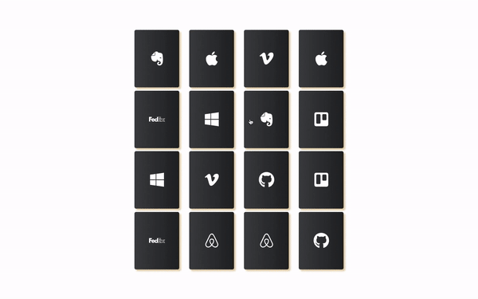

This project was bootstrapped with [Create React App](https://github.com/facebook/create-react-app).

A simple memory card game made in reactjs

# Play by running

## Using npm

```bash
# install dependencies
npm install
# run app in locat
npm start
```

## Using yarn

```bash
# install dependencies
yarn install
# run app in locat
yarn start
```

# Demo



https://react-memory-card.web.app/
